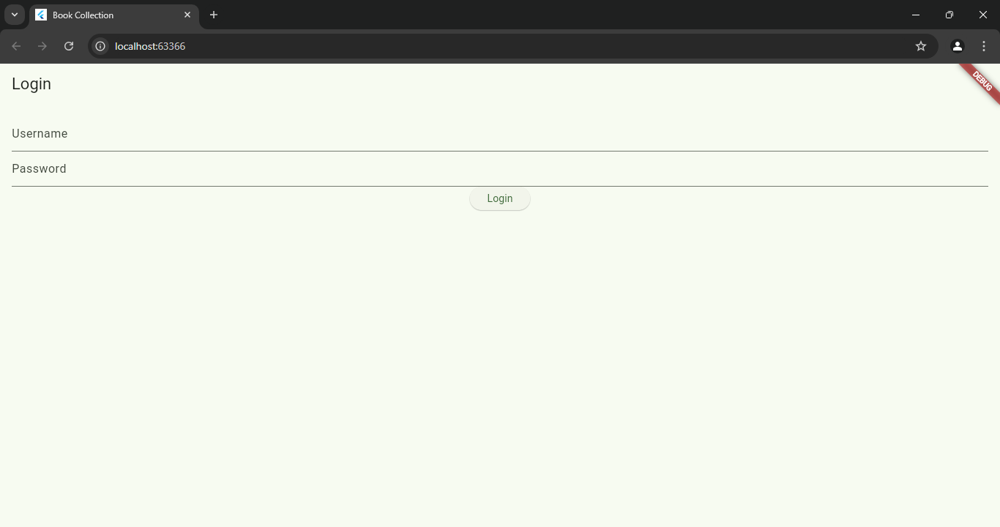
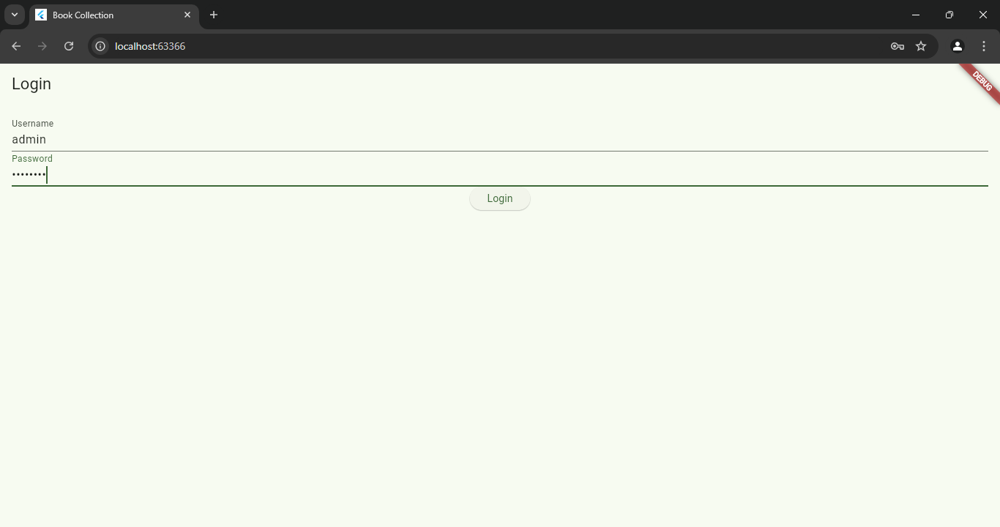
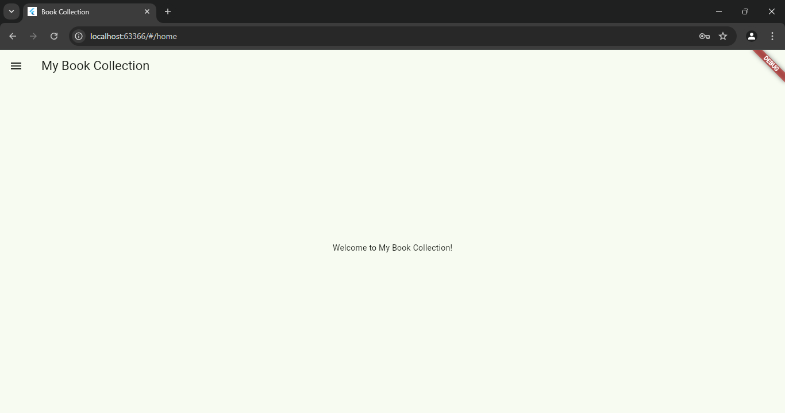
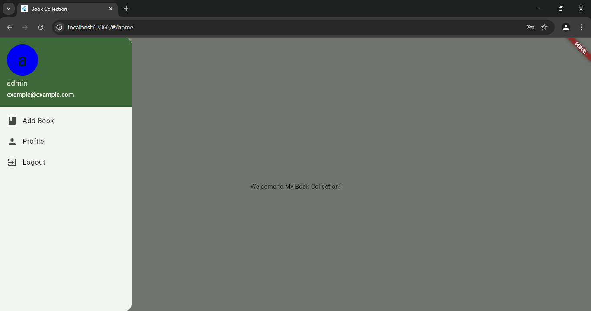
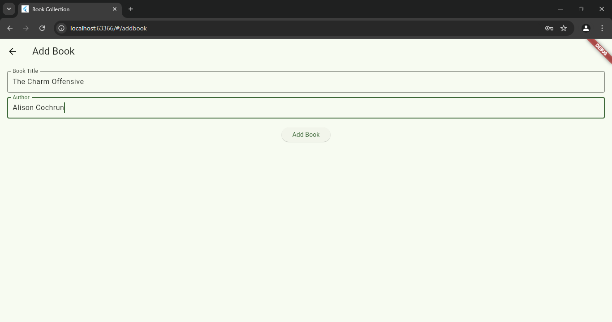
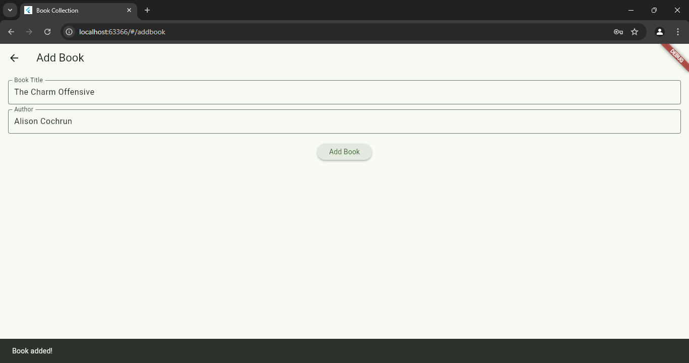
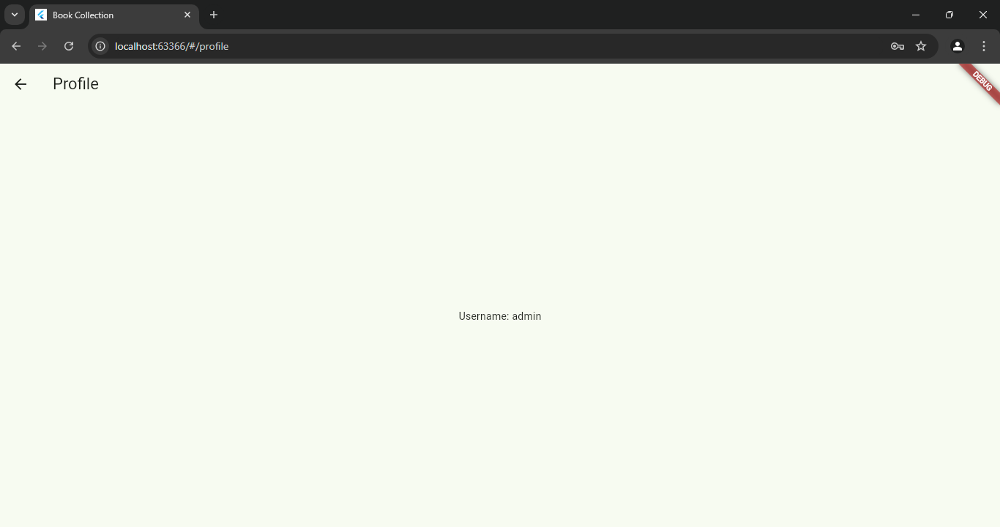

# Tugas 3 Mobile

Tugas 3 Praktikum Mobile
Nama: Hasna Mumtazah Khairunnisa
NIM: H1D022070
Shift Baru: E

## Penjelasan Kode

1.main.dart
MyApp Class: Titik awal aplikasi. Pada method build(), aplikasi menggunakan MaterialApp untuk mendefinisikan semua karakter aplikasi. 
Routes: Aplikasi mendefinisikan beberata route, seperti / (halaman login), /home (halaman utama), /addbook (halaman tambah buku), dan /profile (halaman profil).
Initial Route: Aplikasi akan dimulai dari route '/' yang adalah halaman login.

2.login_page.dart
Fungsi Login Page: Shared Preferences digunakan untuk menyimpan username setelah login berhasil. Shared Preferences menyimpan data di local storage, jadi data login tetap ada walaupun aplikasi ditutup.
Saat login, validasi dilakukan dengan username "admin" dan password "admin123". Jika berhasil, pengguna akan dialihkan ke halaman Home ('/home'). Jika gagal, akan muncul dialog error.

3.home_page.dart
Layout Home Page: Ini adalah halaman utama setelah login berhasil. Pada halaman ini terdapat side menu (drawer) yang mengarahkan ke halaman lain, seperti halaman tambah buku dan profil.
Drawer digunakan untuk menampilkan menu navigasi yang terdapat di sebelah kiri layar.

4.side_menu.dart
Fungsi Side Menu (Drawer): Side menu memungkinkan navigasi antar halaman aplikasi. Setiap ListTile dalam drawer mengarah ke halaman tertentu melalui Navigator.pushNamed.
Menu Logout menghapus username yang tersimpan di Shared Preferences dan mengarahkan pengguna kembali ke halaman login.

5.add_book_page.dart
Fungsi Add Book: Pada halaman ini, pengguna bisa menambahkan informasi buku, seperti judul buku dan pengarang. Namun belum ada penyimpanan data ke local storage. Pengguna mendapatkan feedback bahwa buku berhasil ditambahkan melalui SnackBar.

6.profile_page.dart
Fungsi Profile Page: Halaman ini menampilkan informasi username yang disimpan dalam Shared Preferences. Saat pengguna login, username akan disimpan dan ditampilkan di halaman profil.

